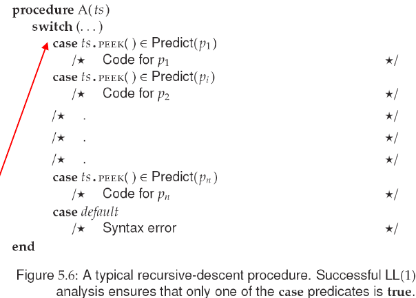

# Recursive-descent parsing

input: a sequence of tokens -&gt; stream ts

ts:

* peek
  * 查看下一個token，但不移動pointer
* advance
  * 查看下一個token，但pointer移至下一個token

* A =&gt; λ
  * return immediately
* Otherwise
  * Xi is terminal symbol
  * Xi is non-terminal symbol

