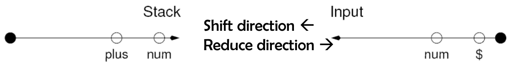

# Chapter 8

* Bottom-up
* shift reduce
* LR\(k\)
  * parsing engine
  * technique for engine table

## shift-reduce parser

needles for parsing

* stack 
* input buffer

### shift-reduce parsing technique

* parse-table
* TOS\(\)
* peek\(\)

## LR\(k\) Parsers

### LR\(0\) table construction

#### item & bookmark

* item = production + bookmark
* bookmark - progress bar

